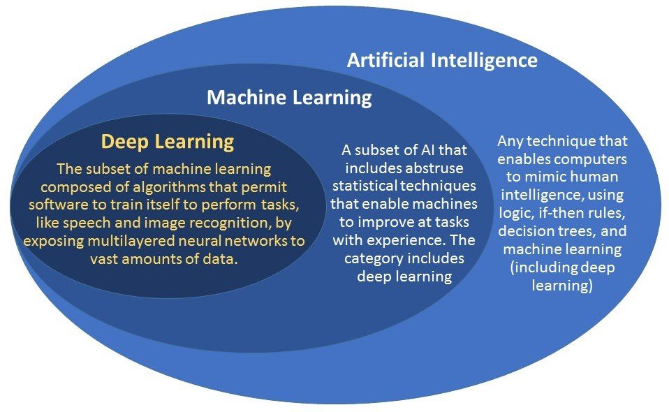

**DEEP LEARNING**

    Deep learning is a class of machine learning algrothim that uses multiple layers to progressively extract higher-level features from the raw input.

    Deep learning is based on artificial neural network.

**ARTIFICIAL NEURAL NETWORK**

    ANN is vaugely inspired by biological neural network. It is not just an algrothim but a frame work for many different machine learning algrothims to work together and complex data inputs.

    In common ANN implementations, the signal at a connection between artificial neuron is a real number. The output of the each neuron is computed by some non-linear function of the sum of its input. The connection between artificial neuron are called **edges**.

    Artificial neuron and edges typically have a weight that adjusts as learning proceeds. The weight increases or decreases the strength of the signal at connection.

    Artificial neurons may have **threshold** such that the signal is only sent if the aggregate signal crosses the threshold. The artificial neuron are aggregated into layers, different layers may perform different kind of transformation on the inputs.

From above figure we get the concept of 

**PERCEPTRON/SINGLE LAYER NEURAL NETWORK.**

    **PERCEPTRON**

        Perceptron is used in supervised learning. It is a single layer neural network. It is a linear classifier. Single layer neural network are only capable of learning linearlly seperable data.

        The perceptron consists of 4 parts:
        1. I/P layer(one input layer).
        2. Weight and bias.
        3. Net sum.
        4. Activation Function.

**How does single layer neural network work ?**

    It works in following step:
    1. All the input layer is multiplied with its weight.
    2. Add all the multiplied values and call the weighted sum and add bias.
    3. Apply the activation function.

    The weights are real number and can  be positive or negative.

    Artificial neural network also have threshold such that the signal is only sent if the aggregate signal crosses the threshold. 

    Lets see a small example.

    Input: 

    X1 = 0.6,

    X2 = 1.0

    Weight:

    w1 = 0.5

    w2 = 0.8

    Threshold = 1.0

    Applying the concept of neural network.

    (X1 * w1) + (X2 * W2)= (0.6 * 0.5) + (1.0 * 0.8) = 1.1

    Here the total output value is higher then Threshold value , thus the neuron fires.

**Delta Rule is the gradient descent learning rule for updating the weight of the input to artificial neurons in a single-layer neural network.**

**Why do we use weight and bias?**

    Weight:

    For single layer neural network, The weight increases or decreases the stength at the output of the neuron before getting into summation.

    For MLP(Multi layer perceptron), the weight increases or decreases the strength of the signal at connection. 

    In one sentence, weight shows the strength of the particular node. 

    Bias:

    Bias is a constant value to make the weighted sum non zero if weight and input dot product is given zero.
    A bias value also allows you to shift the activation curve up or down.

**What is activation function and why do we need them ?**

    Activation function decides whether the neuron should be activated or not by calculating the weighted sum and further adding bias with it. The purpose of activation function is to introduce non linearity into the output of a neuron.

    We know , neural network has neurons that work in correspondance of weight , bias and their respective activation function. 

    In neural n/w , we update weights and biases of the neuron on the basis of the error at the output. This process is called **BACKWARD PROPAGATION.**

    Activation function makes back propagation possible since the gradient are supplied along with the error to update the weight and biases.

**Why do we need non linear activation function?**

    A neural network without any activation function is essentially just a linear regression model. 

    The non linear activation function does the non linear transformation to the i/p making it capable to learn and perform more complex tasks.

    It dosent matter how many hidden layers we attach in neural network , all layers will behave in same way because the composition of a two linear function is a linear function itself. Neuron can not learn with just a linear function attached to it,so we need non linear activation function. 

**Types of activation functions**

1. Binary Step Function:

    Binary step function is a threshold base activation function. If the input value is above a certain threshold, the neuron is activated and sends exactly the same signal to next layer.

    Activation function, 
    A = 1 (activated) if y > threshold,
      = 0 , otherwise.
    
    **Disadvantage:**
    Suppose you are creating a binary classsifier which returns yes or no i.e. activated or not.
    A binary step function will do that for you as it returns 1 for greather then threshold value or 0 for lower then equal to threshold value.

    Now think about the use case where you want multiple such neurons to be connected to bring in more classes i.e. class1 , class2 , class3 etc.
    What will happen if more then one class have value greater then threshold value. This will lead to activate more then 1 neuron. 
    
    Hence the classification will not be accurate as we want only one neuron to be actiavted for a particular class.

2. Linear function.

    range is -inf to +inf.

    The linear activation function is also called “identity” (multiplied by 1.0) or “no activation.” This is because the linear activation function does not change the weighted sum of the input in any way and instead returns the value directly.
    
    A linear activation function takes the form 
    a = CX

    It takes the inputs and create an output signal proportional to the input.
    
    **Diadvantage:**

    a. Not possible to use back propagation(gradient descent) to train the model.

    A = CX, derivatives with respect to X is c.

    Backpropagation is possible when the derivative of activation function is going to return non linear value.
    But in case of linear function, the derivative return constant value and also the ouput of derivative of linear function have no relation with input. 

    b. A layers of neural network collapse into one.

    When we apply linear activation function there is no advantage of using multiple layers as the combination of linear function is a linear function. Hence complex data is not trained as a result DeepLearning is not performed in this case. 
    
3.**Non_Linear Activation function:**

    Modern neural network model use non-linear activation functions.

    They allow the model to create complex mapping between the netowrks inputs and outputs which are essential for learning and modeling complex data such as images, video, sudio, and data sets which are non-linear or have high dimensionality.

    Non_linear activation functions addresses the problem of a linear activation function.

    They allow backpropagation because they have a derivative function which is realted to the inputs.

    They allow stacking of multiple layers of neurons to create deep neural network. Multiple hidden layers of neurons are needed to learn complex data sets with high level of accuraccy.

**List of non linear activation function:**

1. Sigmoid function.

    It is a function which is plotted as 'S' shaped graph.
    It is non linear in nature. So stacking layers will make impact on perforamnce.
    It has smooth gradient.

    a = 1/(1 + e^-x).

    Notice, between X values -2 to 2, Y values are very steep. This means any small change in value of X in that region will cause values of Y to change significantly.

    The range of value is 0 to 1.
    Used in output layer of binary classification where he result is either 0 or 1.

    If the value is greater then 0.5 then it is taken as 1 or it is taken as 0.

    Appears in output layer of deep learning models and is used for predicting probability based outputs.

    It is used in feedforward neural network.

    **Advantage:**

    Smooth gradient , preventing jumps in output values.

    output values bound between 0 and 1, normalizing the ouput of each neuron. Therefore, it is usually used for model where we have the predict the probability as an outputs.

    Clear prediction - for x above 2 or below -2 tends to bring the Y value(the prediction) to the edge of the curve, very close to 1 or 0. This enables  clear prediction.

    Unlike linear function , output of the actiavtion function is always going to be in range (0, 1) compared to (-inf , inf) of linear function. So we have our activation bound in a range.

    **Disadavantage:**

    vanishing gradient - for very high or very low values of x, there is almost no change to the prediction causing vanaishing gradient problem.
    This can result in network refusig to learn further, or being too slow to reach an accurate prediction.

    Outputs are not zero centred.

    computationally expenxive.

2. Tanh function.

    It is also known as tangent hyperbolic function.
    It looks very similar to sigmoid . In fact, it is a scaled sigmoid function.

    tanh(x) = 2sigmoid(2x) - 1.

    value range is -1 to 1. So, no worries of activation blowing up.
    It Nature is non linear. So we can stack layers without any problem.
    Usually used in hidden layers.
    Gradient for tanh is stronger then sigmoid(derivatives are steeper).
    Deciding between the gradient or tanh will depend on your requirement of gradient strength.

    It is used in feedforward neural network.

    **Advantage over sigmoid:**

    It gives zero cenred output thereby supporting the bacpropagation process.
    Better training process for multilayer neural network.
    Most widely used in Recurrent Neural Network for natural language processing and speech recogonition tasks.
    The negative inputs will be mapped strongley negative and zero input will be mapped near zero in the tanh graph.

    **Disadavantage:**

    Like sigmoid , tanh have also vanishing gradient problem.

3. ReLU function.

    It stands for rectified linear unit. It is most widely used activation function.
    Implemented in a hidden layer of nureal network.

    The relu functio performs a threshold operations on each input element where all values less than zero are set to zero. Thus the relu is represented as

    f(x) = max(0, x) = {Xi, if Xi >= 0}
                       {0 , if Xi <= 0>}
    range is 0 to inf.
    It is non linear in nature.

    The relu is half rectified from bottom.
    Looks like linear but is non linear function.

    All the negative values are considered zero.

    **Sparsity of activation**

    Imagine a big neural netowrk with lots of neurons. Using a sigmoid (0,1) or tanh (-1,1) will cause almost neurons to fire in a analog way. This means almost all activations will be processed to describe the output of a network. In other word actiavtion is dense and this is costly.

    We will ideally want a few neurons in the network not to be activated and there by making the activations sparse and efficient.

    Relu gives us this benifit. Imagine a network with random initialized weights and almost 50% of network yeilds zero activation because of the characteristics of Relu( output 0 for negative values of X).

    This means a fewer neurons are firing(sparse activation)and the network is lighter.

    **Advantage:**
    computationally efficent - allows the network to converge very quickly. 

    Non-linear - although it looks like a linear function, ReLU has a derivative function and allows for back propagation.

    eliminates the vanishing gradient problem.

    **Disadvantages:**
    The Dying ReLUproblem - when input apporach zero , or are negative the gradient of the function becomes zero, the network cannot perform back propagation and cannot learn. 

    However , ther are concepts such as Leaky ReLU that can be used to overcome this problem. Also having a proper setting of learning rate can prevent causing the neurons to be dead.

    Note:
    It is less computationally expensive than tanh and sigmoid because it involves simpler mathematical operations. At a time only few neurons are activated making the network sparse making it efficent and easy for computation.
    Relu learns much faster then sigmoid and tanh.

4.Leaky ReLU

    The figure on the right side is of leaky relu.
    It is an attempt to solve the dying relu problem. 

    LeakyRelu(z) = max(0.01 * z , z)
    Can you see the leak?
    The leak helps to increase the range of the ReLU function.
    Usually, the value of a is 0.01 or so.

    When the value is not 0.01 then it is called Randomized ReLU.
    Therefor the range ofthe leaky relu is 
    -inf to inf.

    **Advantage:**
    
    Prevent dying ReLU.

    **Disadvantage:**

    Results not consistent- Leaky ReLU dosenot provide consistent predictions for negative input values.

5.Softmax function.

    Softmax function doesnot have its graph. Softmax function is similar to sigmoid function but it is handy when we are trying to handle classification problem with more then two classes.

    The softmax function would squeeze the outputs for each class between 0 and 1 and would also divide by the sum of the outputs.
    
    The softmax function is ideally used in the output layer of the classifier where we are actually trying to attain the probabilities to define the class of each input.

    How does softmax function work ?

    Softmax function calculates probability for each class from which the input belongs. The no. of softmax unit in output layer is always equal to the number of classes, so that each unit can hold a probability of class. This is also known as probability distribution where sum of probability for each class is equal to 1.

    Softmax uses the eqaution below for calculating the probability of a clss.

    If neural network produces the arbitart output for each class, we use the above equation to convert them into crosponding probabilities. Finally the model consider higher probability as prediction.

    Note: 
    Softmax function converts each value into probability.

    It is only used as output layer. of neural network.

    Model will consider higher probability as actual output. 

**Choosing the right activation function**

    When you know the function you are trying to approximate has certain characteristics, you can choose an activation function which will approximate the function faster leading to faster training process.

    For exaple, sigmoid works well for classifier because approximating a classifier function as combinations of sigmoid is easier than maybe ReLU, which will lead to faster training process and convergence.

    In case , if you dont know the nature of the function you are trying to learn then you can start with ReLU and then work backwards.
    ReLU works most of the time as general approximator. 

**Derivative or gradient of activation functions**

    The derivative also known as gradient of an activation is extremly important  for training the neural network. 

    Neural network are trained using a process called backpropagation which traces back from the output to the model, through the different neurons which were involved in generating that ouput , back to the orignal weight applied to each neuron.

    Backpropagation suggests an optimal weight for each neuron which results in most accurate prediction.

**Forward Propagation**

    It is nothing but the normal operation of neural network without backward propagation.
    Depth is number of hidden layers.
    Width is number of nodes in each hidden layer.

    It is also known as feed forward neural networ. It is the artificial network where in connection b/w the nodes do not form the cycle.

    The information moves only in one direction,, forward from the input nodes, through the hidden layers(if any) and to the output nodes. There are no cycle or loops in the network.

**Cost function**

    A cost function is the measure of how wrong the model is in terms of its ability to estimate the realtionship b/w x and y.
    It is the difference or distance b/w the predicted value and the actual value.
    The cost function is also reffered as loss or error. 

**MLP (Multilayer Perceptron).**

    In this we have hidden layers which uses non linear activation function to maintain non linearity in the algorithm. It uses back propagation method to updates weight to reduce the error and finally the trained model is considered as a final model. 
    
    BackPropagation:
    Here, the process is carried out same as feed forward network and if the error is more and ifthe model is not giving proper accuracy, back-propagation is done.

    The error is computed at the output and distributed backwards throughout the networks layers. It is commonly used in deep neural networks. Using this information, the algrothim adjust the weights of each connection in order to reduce the value of error function by some small amount. After repeating this process for a sufficiently larger number of traininng cycles, the network will usually converge to some state where the error of the calculation is small. Now, we can say network learn some function. 
    
    To adjust the weight properly, we should use non linear optimization method called gradient descent.
    For, this the network calculates the derivative of the error function with respect to the networks weight and changes the weights such that the error decreases. For this reason backpropagation can only be applied on networks with differentiable activation functions. 
    

    
